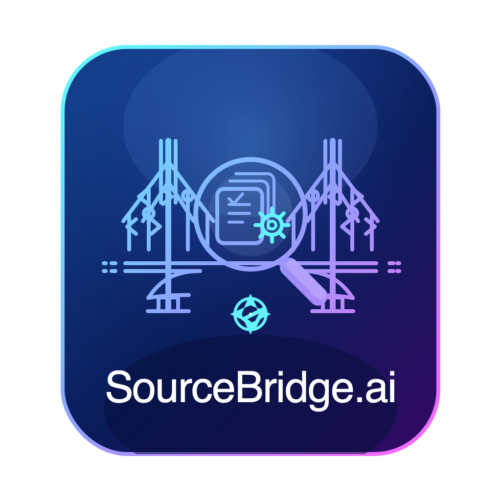

<p align="center">
  
</p>

<h1 align="center">SourceBridge.ai</h1>

<p align="center"><strong>The field guide your codebase should have had.</strong></p>

[](https://github.com/sourcebridge/sourcebridge/actions/workflows/ci.yml)
[](LICENSE)
[](https://go.dev/)
[](https://github.com/sourcebridge/sourcebridge/releases)

## What is SourceBridge?

SourceBridge is a requirement-aware code comprehension platform. Point it at any codebase and it generates field guides -- cliff notes, learning paths, code tours, architecture diagrams, and workflow stories -- so your team can understand how a system actually works. It also traces requirements to code, runs AI-powered reviews, and serves as an MCP server for AI agent integration.

Most tools help you search code. **SourceBridge helps you understand systems.**

<p align="center">
  
</p>

<details>
<summary><strong>More screenshots</strong></summary>

### Cliff Notes
<p align="center">
  
</p>

### Admin Monitor
<p align="center">
  
</p>

### Semantic Search
<p align="center">
  
</p>

</details>

## Key Features

- **Code Indexing** -- Tree-sitter based parsing for Go, Python, TypeScript, JavaScript, Java, Rust, and C++
- **Field Guides** -- Cliff notes, learning paths, code tours, workflow stories, and system explanations at repository, file, and symbol levels
- **Requirement Tracing** -- Import requirements from Markdown or CSV, auto-link to code, generate traceability matrices
- **Code Review** -- AI-powered structured reviews (security, SOLID, performance, reliability, maintainability)
- **Code Discussion** -- Conversational exploration with full codebase context
- **Architecture Diagrams** -- Auto-generated Mermaid diagrams from code structure
- **Impact Analysis** -- Simulate changes and see affected requirements and code paths
- **MCP Server** -- Model Context Protocol support for AI agent integration
- **Multi-Provider LLM** -- Works with cloud APIs (Anthropic, OpenAI, Gemini, OpenRouter) or fully local inference (Ollama, vLLM, llama.cpp, SGLang, LM Studio)
- **GraphQL API** -- Full programmatic access to all platform capabilities
- **CLI** -- Complete command-line interface for scripting and automation

## Quick Start

### Docker Compose (recommended)

The fastest way to try SourceBridge. Requires Docker and Docker Compose.

```bash
git clone https://github.com/sourcebridge/sourcebridge.git
cd sourcebridge
cp .env.example .env   # configure your LLM provider
docker compose up -d
```

Open [http://localhost:3000](http://localhost:3000) for the web UI. The API is at `http://localhost:8080`.

To use a cloud LLM provider, set these in your `.env`:

```bash
SOURCEBRIDGE_LLM_PROVIDER=anthropic
SOURCEBRIDGE_LLM_API_KEY=sk-ant-...
SOURCEBRIDGE_LLM_MODEL=claude-sonnet-4-20250514
```

### Homebrew

Install the CLI directly on macOS or Linux:

```bash
brew install sourcebridge/tap/sourcebridge
sourcebridge serve
```

### One-Command Setup

For local development or evaluation without Docker:

```bash
git clone https://github.com/sourcebridge/sourcebridge.git
cd sourcebridge
./setup.sh
```

This installs dependencies, builds the Go binary and web UI, and starts the server.

### Helm / Kubernetes

For production deployments:

```bash
helm install sourcebridge deploy/helm/sourcebridge/ \
  --set llm.provider=anthropic \
  --set llm.apiKey=$ANTHROPIC_API_KEY
```

See [Helm Guide](docs/self-hosted/helm-guide.md) for full configuration options, including air-gapped and local inference setups.

## Architecture

```
                    ┌──────────────────────────────────┐
                    │           Clients                │
                    │   Web UI / CLI / MCP / GraphQL   │
                    └──────────────┬───────────────────┘
                                   │
                    ┌──────────────▼───────────────────┐
                    │        Go API Server             │
                    │   chi router + gqlgen GraphQL    │
                    │   JWT auth, OIDC SSO, REST       │
                    │   tree-sitter code indexer        │
                    └───────┬──────────────┬───────────┘
                            │              │
               ┌────────────▼──┐    ┌──────▼──────────┐
               │   SurrealDB   │    │  Python Worker   │
               │   (embedded   │    │  gRPC service    │
               │   or external)│    │  AI reasoning,   │
               └───────────────┘    │  linking,        │
                                    │  requirements,   │
               ┌───────────────┐    │  knowledge,      │
               │  Redis Cache  │    │  contracts       │
               │  (optional,   │    └──────┬───────────┘
               │  defaults to  │           │
               │  in-memory)   │    ┌──────▼───────────┐
               └───────────────┘    │   LLM Provider   │
                                    │  Cloud or Local   │
                                    └──────────────────┘
```

**Go API Server** (`internal/`, `cmd/`) -- HTTP and GraphQL API, authentication, code indexing, and request routing. Handles tree-sitter parsing for 7 languages.

**Python gRPC Worker** (`workers/`) -- AI reasoning engine that communicates with LLM providers. Services include reasoning, linking, requirements analysis, knowledge extraction, and contract generation.

**Next.js Web UI** (`web/`) -- React 19, Tailwind CSS, CodeMirror 6 for code display, @xyflow/react for dependency graphs, recharts for metrics, Mermaid for architecture diagrams.

**SurrealDB** -- Primary data store. Runs embedded for single-node setups or connects to an external instance for production.

**Redis** -- Optional caching layer. Defaults to an in-memory cache when Redis is not configured.

## Configuration

SourceBridge reads configuration from a TOML config file and environment variables. Environment variables use the `SOURCEBRIDGE_` prefix and override file values.

See [`config.toml.example`](config.toml.example) for a complete annotated example.

### Key Environment Variables

| Variable | Description | Default |
|---|---|---|
| `SOURCEBRIDGE_LLM_PROVIDER` | LLM provider name | `ollama` |
| `SOURCEBRIDGE_LLM_BASE_URL` | LLM API endpoint | (provider default) |
| `SOURCEBRIDGE_LLM_MODEL` | Model name | (provider default) |
| `SOURCEBRIDGE_LLM_API_KEY` | API key for cloud providers | -- |
| `SOURCEBRIDGE_SERVER_HTTP_PORT` | API server port | `8080` |
| `SOURCEBRIDGE_SERVER_GRPC_PORT` | gRPC port for worker communication | `50051` |
| `SOURCEBRIDGE_STORAGE_SURREAL_MODE` | `embedded` or `external` | `embedded` |
| `SOURCEBRIDGE_STORAGE_SURREAL_URL` | SurrealDB connection URL | -- |
| `SOURCEBRIDGE_STORAGE_REDIS_MODE` | `redis` or `memory` | `memory` |
| `SOURCEBRIDGE_SECURITY_JWT_SECRET` | JWT signing secret | (required for auth) |
| `SOURCEBRIDGE_SECURITY_MODE` | Security mode (`oss` or `enterprise`) | `oss` |

## LLM Providers

SourceBridge supports both cloud-hosted and local inference providers. Configure per-operation models for cost optimization (e.g., a smaller model for summaries, a larger one for reviews).

### Cloud Providers

| Provider | Config Value | API Key Variable | Models |
|---|---|---|---|
| Anthropic | `anthropic` | `ANTHROPIC_API_KEY` | Claude Sonnet 4, Claude Haiku, etc. |
| OpenAI | `openai` | `OPENAI_API_KEY` | GPT-4o, GPT-4o-mini, etc. |
| Google Gemini | `gemini` | `GOOGLE_API_KEY` | Gemini 2.5 Pro, Flash, etc. |
| OpenRouter | `openrouter` | `OPENROUTER_API_KEY` | Any model on OpenRouter |

### Local Inference

| Provider | Config Value | Notes |
|---|---|---|
| Ollama | `ollama` | Easiest local setup. Pull a model and go. |
| vLLM | `vllm` | High-throughput serving with PagedAttention |
| llama.cpp | `llamacpp` | CPU/GPU inference, GGUF models |
| SGLang | `sglang` | Optimized serving with RadixAttention |
| LM Studio | `lmstudio` | Desktop app with OpenAI-compatible API |

All local providers expose an OpenAI-compatible API. Set `base_url` to the local endpoint.

## CLI Reference

| Command | Description |
|---|---|
| `sourcebridge serve` | Start the API server |
| `sourcebridge index <path>` | Index a repository with tree-sitter |
| `sourcebridge import <file>` | Import requirements from Markdown or CSV |
| `sourcebridge trace <req-id>` | Trace a requirement to linked code |
| `sourcebridge review <path>` | Run an AI-powered code review |
| `sourcebridge ask <question>` | Ask a question about the codebase |

See [CLI Reference](docs/user/cli-reference.md) for full flag documentation.

## Development

### Prerequisites

- Go 1.25+
- Python 3.12+ with [uv](https://docs.astral.sh/uv/)
- Node.js 22+
- Git

### Building from Source

```bash
# Clone the repository
git clone https://github.com/sourcebridge/sourcebridge.git
cd sourcebridge

# Build the Go API server
make build-go

# Install Python worker dependencies
make build-worker

# Build the web UI
make build-web

# Or build everything at once
make build
```

### Running Locally

```bash
# Start the API server (builds first)
make dev

# In a separate terminal, start the web UI in dev mode
make dev-web
```

### Testing

```bash
# Run all tests (Go + web + worker)
make test

# Run linting (Go + web + worker)
make lint

# Run CI checks locally (lint + test)
make ci
```

See [CONTRIBUTING.md](CONTRIBUTING.md) for the full development workflow.

## Deployment

### Docker Compose

Best for evaluation and small teams. See [Docker Compose quick start](#docker-compose-recommended) above.

### Kubernetes with Helm

For production and multi-team deployments:

- [Helm Guide](docs/self-hosted/helm-guide.md) -- Installation, values reference, and examples
- [Deployment Guide](docs/admin/deployment.md) -- Architecture considerations and scaling
- [Air-Gapped Installations](docs/self-hosted/air-gapped.md) -- Deploying without internet access
- [Upgrade Guide](docs/self-hosted/upgrade.md) -- Version upgrades and migrations
- [Backup and Restore](docs/admin/backup-restore.md) -- Data protection procedures

## Documentation

- [Getting Started](docs/user/getting-started.md)
- [CLI Reference](docs/user/cli-reference.md)
- [Web UI Guide](docs/user/web-ui-guide.md)
- [Configuration](docs/admin/configuration.md)
- [Troubleshooting](docs/admin/troubleshooting.md)

## Contributing

Contributions are welcome. See [CONTRIBUTING.md](CONTRIBUTING.md) for development setup, coding standards, and the pull request process.

First-time contributors must agree to the [Contributor License Agreement](CLA.md) before their PR can be merged.

## License

SourceBridge is licensed under the [GNU Affero General Public License v3.0](LICENSE).

---

## Did it work?

If SourceBridge helped you understand a codebase, let us know:

- **It worked?** Give the repo a star — it helps others find the project
- **Something broke?** [Open an issue](https://github.com/jstuart0/sourcebridge/issues) — we want to fix it
- **Have ideas?** [Start a discussion](https://github.com/jstuart0/sourcebridge/discussions)
